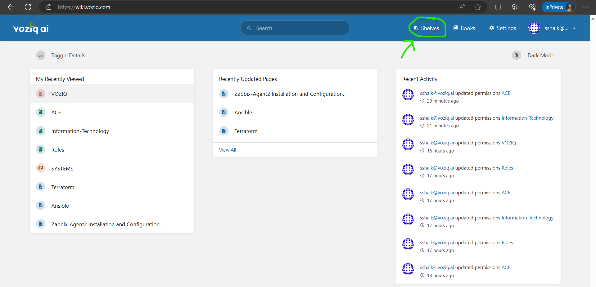

1. Paste the below url in the browser
`https://wiki.voziq.com`

2. Enter the username and password
 
 
 
3. Click on the `Sign in` button.
4. Approve the Microsoft Authentication.
5. Now you are successfully logged into the Application.
   
* Now You will be able to see `Shelves` and `Books` section.
 
 

* Click On Shelves you will see the `VOZIQ` shelve, 
After that click on shelve you will be able to see your Department Book.
 
* If you dont find your book, You can create one by selecting `create new book` option to the top right-hand side.

  
* You should Give your Department name and then a `cover-image` then save. additionally you can add the description about your book.

`Note`: 
* `Every page will act as an Individual Document.`
* `If you have a bunch of documents related to one topic or one project you can create a `chapter` and create multiple pages as documents in the same chapter.`

# Individual Document:

* Now click on `Create a New Page` and start writing your documentation.
  

# Multiple Documents with in the chaper.

* Navigate your book and click on `Add a Chapter` give the chapter name and save.
  
*   

* Now you can create `Documents` related to that specific chapter as `pages`.

* You can create multiple pages with in the chapter.
* For overview look for the below picture.
  
* You can see that Inside your department you have a chapter named `Your chapter name` and related documents in it as `page1` `page2` `page3`.
* Also we have individual documents that named as `Individual Doc` and `Individual Doc2`
* This way we can create pages and chapters.

#### Some Basic Features of Bookstack are:

1. You can choose the type of header you want in the Documentation.
 

2. You can Indicate anything like Information, Warining, by using `Callouts`.
 

3. To Upload a picture, Click on the `Image Icon` and there you will find the `Upload Image` option.
 
* Now click on the Upload Image option and upload the Image, It will be uploaded to bookstack gallery.
 
 
 
* You can find it in the gallery, select image and click on `select image` option It will be uploaded.
 
4. Bookstack has an option to draw diagrams inbuilt using draw.io
 
5. You can add the attachments and and files using the `Attachments` section to the right.
 

* After you save the page you can see them under attachments section.
* You can download and view them in web, they are located within your page top-left side.

6. After Completing the document save and you will see your documentatin saved as page.
 
 

#### Deleting the Pages.

`Note`

* Before deleting the pages save the data or confirm with your team.
* `The data that is deleted cannot be undone.`
* `Never ever to delete the book` you will loose everythig related to your department.
* To delete a specific `page` you can go into that page and you can see `Delete` option on right-hand side, It will ask you to confirm and your page will be deleted.
 

* The same way chapter, enter into the chapter you want to delete and `click on delete option` and chapter will be deleted.
 .

#### Exporting Documents in pdf format.

* Bookstack has a feature called `Export` using this option we can download our documents.
* We can export the documents in `Book-level`,`page-level`, and `Chapter-level`
 

