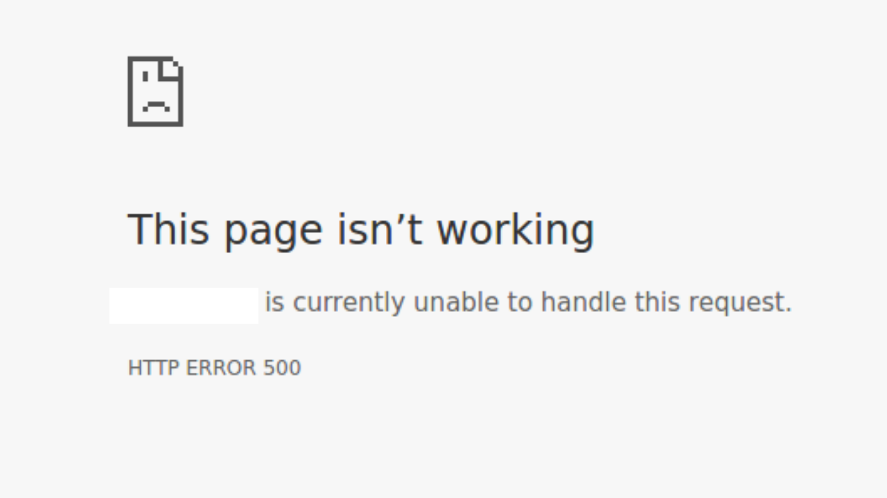
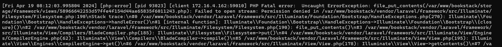
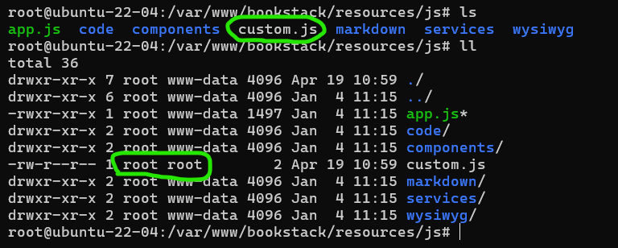
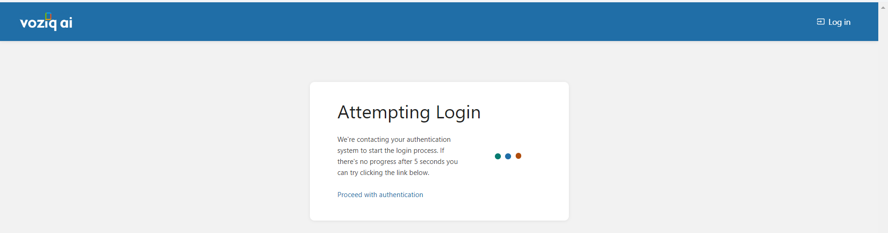

### Issue-2
### Bookstack: Getting 500 error after adding custom js file.



After Checking logs found: 



Solution:

While changing any file in Bookstack take a backup for that file.

By default when changing any file to the custom file in Bookstack it will override the original file.

 I have changed and added the custom.js file in the path `/var/www/bookstack/resources/js/custom.js`


Added the script file in `/var/ww/bookstack/resources/views/layouts/base.blade.php` head section.

```
<!DOCTYPE html>
<html lang="{{ isset($locale) ? $locale->htmlLang() : config('app.default_locale') }}"
      dir="{{ isset($locale) ? $locale->htmlDirection() : 'auto' }}"
      class="{{ setting()->getForCurrentUser('dark-mode-enabled') ? 'dark-mode ' : '' }}">
<head>
    <title>{{ isset($pageTitle) ? $pageTitle . ' | ' : '' }}{{ setting('app-name') }}</title>
    <script src="{{ asset('js/custom.js') }}"></script> <!-- Here I have added custom script path -->


    <!-- Meta -->
    <meta charset="utf-8">
    <meta name="viewport" content="width=device-width">
    <meta name="token" content="{{ csrf_token() }}">
    <meta name="base-url" content="{{ url('/') }}">
    <meta name="theme-color" content="{{(setting()->getForCurrentUser('dark-mode-enabled') ? setting('app-color-dark') : setting('app-color'))}}"/>
```

Permissions are also changed to the file, so need to change the file permissions with the appropriate user group.
* `sudo chown -R www-data:www-data custom.js` and `chmod -R 755 custom.js`
* copy the path where you are changing the code.
look for logs of apache2 and Bookstack 
* `Apache2 log path  /var/log/apache2/error.log`
* `Bookstack log path /var/www/bookstack/storage/logs/laravel.log`
After adding the custom.js file automatically the file permissions changes and will get the **permission-denied error.** 
* Also, change the **storage directory** permissions and ownership with 
```
sudo chown -R www-data:www-data storage
sudo chmod -R 775 storage
```
* Now Restart the Apache2 server and check
